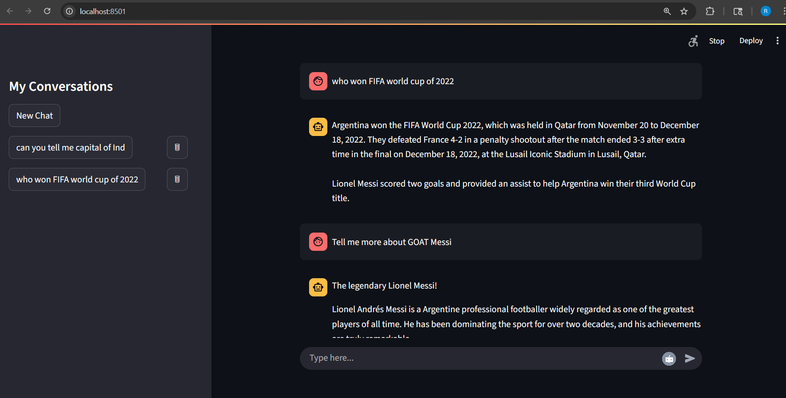

Folder working_chatbot_pictures have Demo of this project

-----------------------x--------------------x-----------------------x------------------------------x----------------------

Steps to run the project

1) Clone the repo
<!-- Assuming you have docker setup already-->
2) docker-compose up --build   <!-- build docker images and start containers -->
3) docker exec -it ollama-container-chatbot ollama pull llama3.1    <!-- Pull lamma 3.1 under ollama container -->
4) Hit http://localhost:8501/  and run chatbot